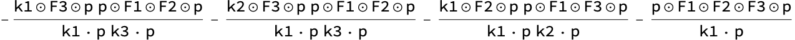

# HEFT Numerators from Kinematic  Algebra

This algorithm implements the construction of the numerator factor for the multigluon emission from a massive scalar in heavy mass effective field theory from the stringy kinematic algebra.

The algorithm is presented in the paper

**HEFT Numerators from Kinematic  Algebra** 
[2501.14523](https://arxiv.org/abs/2501.14523)
by [Chih-Hao Fu](https://orcid.org/0009-0006-0341-7102), [Pierre Vanhove](https://pierrevanhove.github.io) and [Yihong Wang](https://inspirehep.net/authors/1509995?ui-citation-summary=true)

## Files

1. [functionsHEFT.wl](functionsHEFT.wl): Contains all the defined functions used for symbolic computations.
2. [HEFT-numerators.nb](HEFT-numerators.nb): Mathematica worksheet that includes usage examples demonstrating how to call the functions and their expected outputs. A pdf output of this worksheet is [HEFT-numerators.pdf](HEFT-numerators.pdf)
3.  [numerator-six-gluons.txt](numerator-six-gluons.txt): the numerator for the emission of six gluons. Size of the file 342555.
4.  [numerator-seven-gluons.txt](numerator-seven-gluons.txt): the numerator for the emission of seven gluons. Size of the file 3816849.
3. [numerator-eight-gluons.txt](numerator-eight-gluons.txt): the numerator for the emission of eight gluons. Size of the file 47372948.

## How to Use

Open `functionsHEFT.wl` in Mathematica and evaluate the entire notebook to load all functions.

### Functions

The functions provided are function of `Ngluons` the number of the emitted gluons and `P` the momentum of the incoming massive particle

* `GIAOTree[Ngluons,P]` which generates all the tree graphs  as described in section 4.2 of the paper
* `GINum[Ngluons,P]` which generates the numerator  using the algorithm in paper 
* `QMNum[Ngluons,P]`  which generates the numerator  using the algorithm described in these papers [A new gauge-invariant double copy for heavy-mass effective theory](http://arxiv.org/abs/2104.11206) by A. Brandhuber, G. Chen, G. Travaglini and C. Wen  and [Kinematic Hopf Algebra for Bern-Carrasco-Johansson Numerators in  Heavy-Mass Effective Field Theory and Yang-Mills Theory](http://arxiv.org/abs/2111.15649) by A. Brandhuber, G. Chen, H. Johansson, G. Travaglini and C. Wen 

The  gluons have massless momentum $k_i$ and $k_i^2=0$, and the two massive scalars have massive momentum $p$ and $p'$ with $p^2=(p')^2\neq0$.
We have the Momentum conservation $k_1+...+k_n= p'-p$

### Three gluon example


```mathematica
GIAOTree[3, p]
(* lists all the rooted tree graphs for the emission of 3 gluons as described in section 4.2 *)
```
<center>

</center>

```mathematica
GINum[3, p]
(* Outputs the numerator factors for the emission of 3 gluons*)
```

<center>

</cente>
